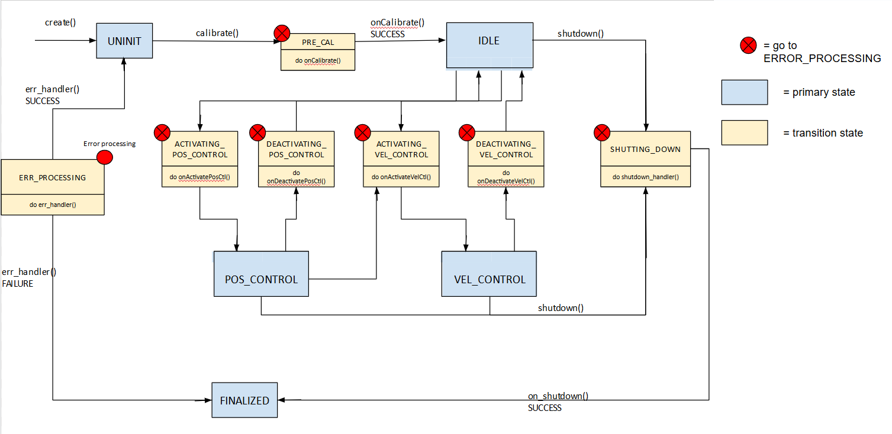

# `motor_controller` package

For the Autonomy Repo in development, see https://github.com/WATonomous/wato_rover

## How to run

- Launch: `ros2 launch launch.py`. This will automatically trigger transitions and calibration to reach the `VEL_CONTROL` state.
    - Now that we are in the `VEL_CONTROL` state, we can send twist messages to the `cmd_vel` topic (using joystick or keyboard).
    - To view the computed velocities, echo the `/cmd_vel_out` topic or `/OdriveJsonSub` topic
- To reset back to the `UNINIT` state, run  `ros2 service call /state_manager/change_mc_state motor_controller/srv/ChangeState "{transition: {id: 64, label: 'reset'}}"`
- To recalibrate after reset, run  `ros2 service call /state_manager/change_mc_state motor_controller/srv/ChangeState "{transition: {id: 6, label: 'calibrate'}}"`
- To transition to the `VEL_CONTROL` state again, run  `ros2 service call /state_manager/change_mc_state motor_controller/srv/ChangeState "{transition: {id: 12, label: 'active_vel_control'}}"`

## `ArcadeDriver` component

Subscribes to Twist messages from `cmd_vel` topic and computes two values (`l` and `r`) for left and right side motor speeds.

`l` and `r` are published to the `arcade_speed` topic.

## `MotorSpeedController` component

Subscribes to `arcade_speed` topic and computes 6 motor speeds (3 left, 3 right) using `l` and `r` as baseline.

The 6 motor speeds are published to the `cmd_vel_out` topic.

## `StateManager` component

Manages transitions between states. TODO: UPDATE THE DIAGRAM

